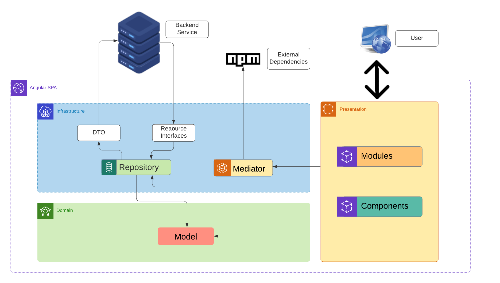

### Executando o projeto localmente

```bash
# Clone este repositório
$ git clone git@github.com:idealcode-br/angular-architecture.git

# Acesse a pasta do projeto no cmd/terminal
$ cd angular-architecture

# Instale as dependências
$ npm install

# Execute a aplicação em modo DESENVOLVIMENTO
$ ng serve

# Execute a aplicação em modo PRODUÇÃO
$ ng build

# Execute testes unitários via Karma
$ ng test
```

O aplicativo iniciará na porta 4200. Para visualizá-lo navegue até <http://localhost:4200>. O aplicativo será recarregado automaticamente se você alterar algum arquivo no projeto.

# Contexto, Infraestrutura e Cross-cutting concerns

Para alcançar o objetivo do projeto, foi construído um novo Design System e estabelecida a aplicação de Single Page Applications através do framework Angular. Uma das principais preocupações iniciais foi maximizar a componentização e reuso de código para garantir, não apenas qualidade e manutenabilidade mas, principalmente, uma UX consistente entre todas as aplicações.
Uma estratégia comumente utilizada para endereçar tal problema é utilizar pacotes NPM contendo os componentes desejados. Infelizmente, o uso desta também acarreta em vários overheads de manutenção, pois se torna progressivamente complexo gerenciar e atualizar tais versões através de um conjunto grande de aplicações, Isso leva, muitas vezes, a breaking changes inesperadas que eventualmente causam incompatibilidade e geram divisões virtuais na base de código.

Como alternativa, foi adotado o conceito de monorepo. Tal modelo permite a manutenção de todas as aplicações e suas dependências com a biblioteca de componentes sempre sincronizada. Isso significa que quaisquer mudanças na biblioteca de componentes deve ter suas repercussões em todas as aplicações analisadas e mitigadas no momento em que a mudança é feita, dessa maneira todas as aplicações estão sempre usando a última versão de cada componente e breaking changes passam a ser consideradas na hora da implementação de cada mudança. Somados ao conjunto de testes automatizados e implantação de CI/CD, essa estrutura fornece confiança para executar mudanças necessárias e segurança de que o ecossistema de aplicações não apenas está sempre atualizado em relação a biblioteca de componentes, mas também funcionando da maneira esperada.

# Aplicação

A arquitetura da aplicação se baseia no conceito de Clean Architecture, idealizada por Robert C. Martin, que permite uma melhor organização, leitura e manutenção do código.



## Domain

Contém definições de modelos e validações, assim como qualquer outra preocupação que não tenha influência direta da aplicação em si. Por exemplo, um dado imposto existe e tem regras e funcionamento bem definidos independentemente da aplicação que o gerencia. É importante frisar que esta camada também viabiliza a implementação de regras relacionadas ao domínio da aplicação.

* **Model**: Classes simples ou básicas; entidades. No contexto de uma aplicação front-end SPA, essas classes tendem a acompanhar mais o negócio de mostrar dados, o que pode ser um pouco contra-intuitivo. Uma boa maneira de encarar essas classes é como uma camada adicional de proteção contra mudanças externas. A utilização das mesmas em conjunto com os repositórios possibilitou por exemplo que o front-end fosse desenvolvido sem conhecimento prévio do back-end, mitigando o risco de grandes mudanças.

* **Validation**: Como o nome sugere, pode-se adicionar regras de validação específicas aqui. É importante ressaltar que, como parte da camada de domínio, as regras implementadas aqui devem seguir estritamente a diretivas de que tais regras devem existir independentemente da aplicação em si.

## Infrastructure

O tema principal dessa camada é isolar. Ela protege a aplicação de mudanças externas (em interfaces de APIs ou dependências NPM, por exemplo), melhorando a manutenibilidade e reduzindo riscos.

* **Repository**: Controla o acesso às APIs do back-end. A principal função desta camada é isolar a apresentação e transformar os modelos em dados formatados para o envio através das APIs, bem como transformar os dados recebidos através das mesmas nos modelos supracitados.

* **Mediator**: Tem a função de isolar e padronizar o uso de dependências externas (normalmente, pacotes NPM). O mais claro exemplo da utilização desse padrão é a biblioteca de notificação. A biblioteca permite notificações vindo de qualquer um dos quatro cantos da tela, utilizando uma variedade enorme de animações, etc. Para a Hivecloud, porém, as notificações sempre vem do canto inferior direito e em apenas três cores, dependendo do tipo de notificação. O mediator embrulha e define tais configurações e protege a aplicação contra mudanças futuras na biblioteca ou mesmo viabiliza a substituição da mesma com um custo relativamente baixo.

## Presentation

Camada que define de fato a UI. Aqui, agrupa-se telas, componentes reutilizáveis, layouts e afins.

* **Modules**: Essa divisão delineia basicamente cada seção da aplicação, ou seja, o conjunto de páginas associadas a um determinado item no menu lateral da aplicação. Cada módulo é carregado dinamicamente. Isso ajuda a acelerar a primeira exibição da página, melhorando a percepção de performance por parte do usuário enquanto economiza banda em caso de o mesmo estar usando uma conexão de rede limitada. A estratégia de carregar apenas o que é necessário para cada página da aplicação é chamada de [lazy loading](https://developer.mozilla.org/en-US/docs/Web/Performance/Lazy_loading).

  É imperativo desenhar os módulos de forma que se tornem os mais autocontidos o possível. Eles têm seu próprio roteamento, serviços e formulários.
  Também é comum que sejam divididos em inúmeros componentes menores. Estes não precisam atender requisitos de reuso, sendo comum que sejam utilizados
  apenas em um único lugar. Essa divisão existe apenas para facilitar a legibilidade do código e não há razão técnica ou arquitetônica para justificá-
  los. Servem exclusivamente para dar liberdade para o desenvolvedor produzir o código mais inteligível e menos repetitivo que ele conseguir.

  Frequentemente, isto ajuda a destrinchar grandes tarefas o que viabiliza paralelização e uma melhor percepção de progresso tanto por parte da gerência
  do projeto quanto do próprio time. Esse tópico é muito importante e é expandido na seção a seguir.

* **Components**: A solução foi desenhada com o princípio que menores unidades de código são sempre melhores e de mais fácil manutenção que unidades grandes. Isso é refletido na estrutura do projeto que permite acomodar componentes em níveis diferentes, dependendo do seu propósito:

    * **Componentes de módulo**: São componentes pequenos e específicos, residindo dentro de cada módulo de forma privada. Esses componentes servem a propósitos específicos de cada módulo, ou servem o propósito de manter a base de código mais legível e manutenível. Boa parte dos componentes, é implementado inicialmente assim, sendo depois movido para camadas mais genéricas se necessário.

    * **Componentes de projeto**: Utilizados internamente no escopo de um projeto. Normalmente pertinente a algo específico do domínio do projeto em questão. Estes componentes ficam dentro da pasta presentation/components.

    * **Componentes da library**: Os mais genéricos. Componentes da library estão disponíveis para reutilização e não tem finalidade específica em relação a nenhum projeto.

### _Quando escolher implementar um componente ou usar algo externo?_

Comumente, é preciso decidir entre utilizar um componente externo (provido por bibliotecas como PrimeNG) ou implementar uma alternativa internamente. O processo de decisão para tal normalmente se dá nos seguintes termos::

* **Componente customizado**: A escolha padrão. Sempre que for viável e factível que componente seja implementado internamente, deve o ser. Isso mantém nosso controle sobre o código e permite customizações mais finas. Componentes muito simples ou que possuem um comportamento muito específico para o projeto são implementados dessa forma. Exemplo: FilterComponent.

* **Componente wrapper**: A componentização por meio de extensão de outros componentes externos é dada quando precisamos definir o comportamento do componente ou adicionar algo à ele. Componentes wrapper tornam mudanças de comportamento ou configuração de componentes externos padronizada, melhorando assim a consistência da UX e facilitando a manutenção. Exemplo: CalendarComponent que empacota o PrimeNG Calendar.

* **Componentes externos**: Por último, são utilizados os componentes externos (normalmente providos pelo PrimeNG ou Angular CDK) quando não é viável implementar um componente wrapper devido a alta complexidade. Exemplo PrimeNG Table.

É importante ressaltar que, deve-se tomar cuidado com as bibliotecas externas escolhidas, verificando sempre a compatibilidade com a versão do Angular e a sua adoção e frequência de manutenção. Uma boa prática importante, é a de se preocupar constantemente com as boas práticas citadas na própria documentação do Angular.